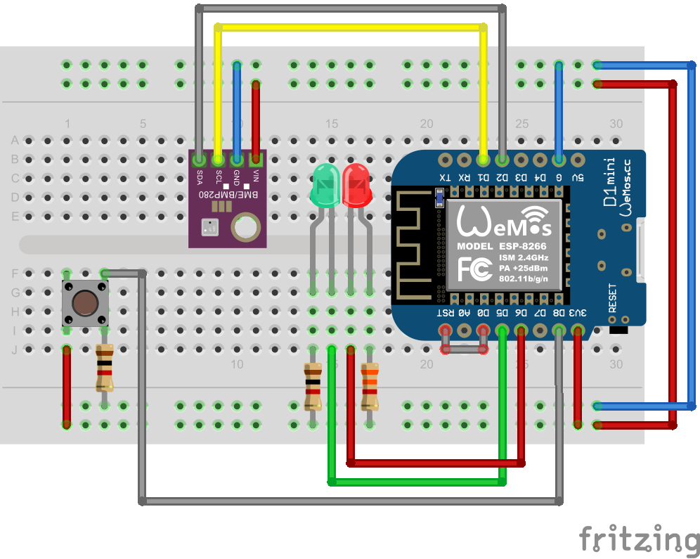

# IotHome.ESP8266Sensor

##Board Configuration:
 - Node MCU 0.9 from ESP8266 v2.7.4 package (not latest one) from https://arduino.esp8266.com/stable/package_esp8266com_index.json

##Used Arduino libraries:
 - AUnit
 - ArduinoJson
 - Adafruit Unified Sensor
 - Adafruit BME280 Library
 - WiFiManager
 

